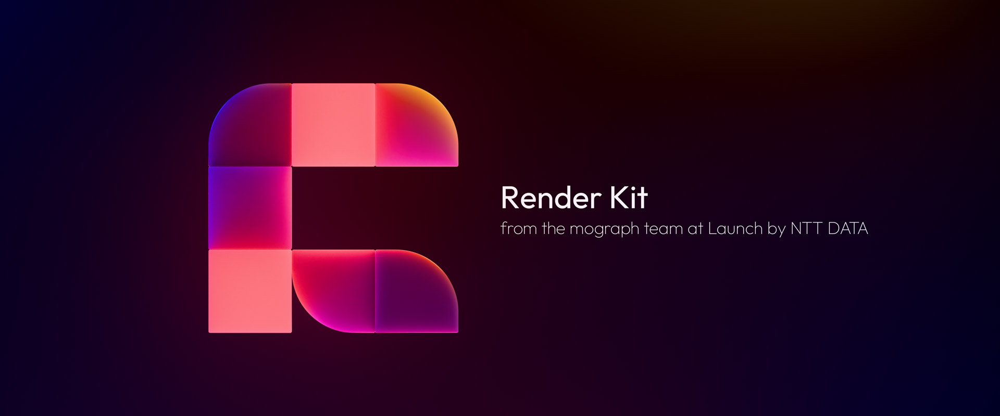
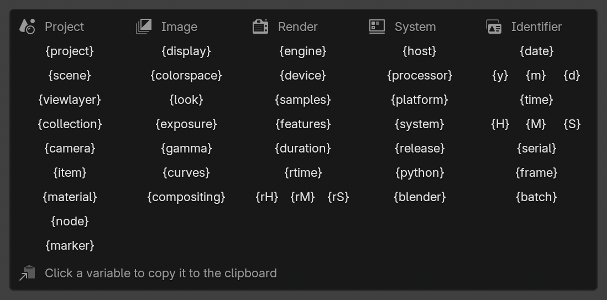
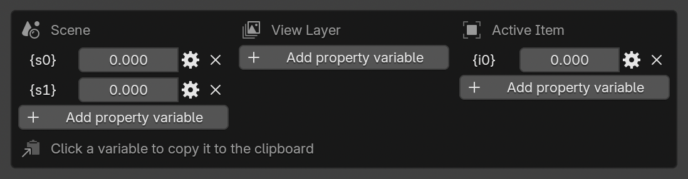
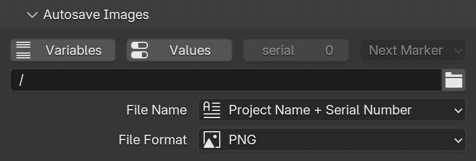
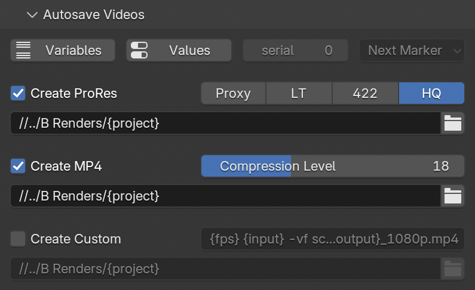
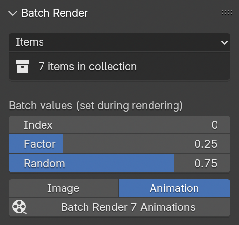
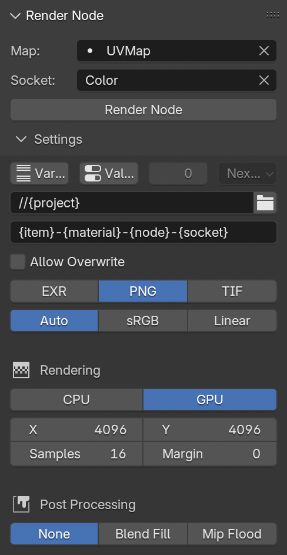
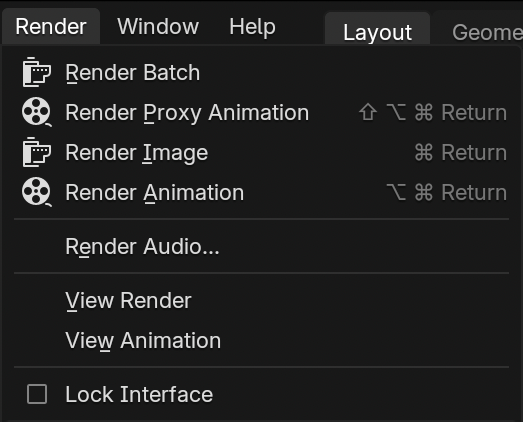
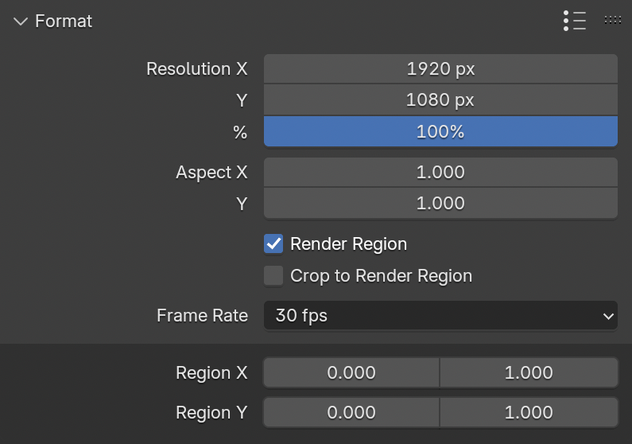

# Launch Render Kit — Blender Rendering Management

## Features:

- ### Render Variables

  - Adds dynamic variables to rendering output paths, including:

    - The name of the current project, scene, view layer, collection, camera, selected item, material, node, socket (for node rendering only), or closest timeline marker

    - The selected render engine, device, samples, features, and rendering duration (in total seconds or HH:MM:SS formats)

    - The current computer host, processor, platform, system type, OS version, Python version, and Blender version

    - Date, time, global serial number, current frame, and batch rendering index (see below batch feature)

      

    - Custom scene, render layer, and object data values that can be set using drivers or animation data

      

- ### Autosave Images

  - Automatically saves every render in a specified folder using custom name and formatting

    

- ### Autosave Videos

  - Automatically processes image sequences using FFmpeg after rendering completes

    

- ### Render Batch

  - One-click rendering of collections, items, cameras, or texture folders to individual images or sequences

    

- ### Render Node

  - One-click baking of material nodes to texture files

    

- ### Render Proxy

  - Shortcut for triggering a proxy render with resolution and engine settings

    

- ### Render Region

  - Adds numerical inputs for the render region feature

    

- ### Render Data

  - Tracks the total time spent rendering a project and displays estimated time remaining during animation sequence rendering

- ### Render Notifications

  - Sends an email, push notification, or announces render statistics at the completion of renders over a given time limit

## Installation via Extensions Platform:

- Go to Blender Preferences > Get Extensions > Repositories > **＋** > Add Remote Repository
- Set the URL to `https://jeinselen.github.io/Launch-Blender-Extensions/index.json`
- Set the local directory if desired (relative paths seem to fail, try absolute instead)
- Enable `Check for Updates on Start`
- Filter the available extensions for "Launch" and install as needed

## Installation via Download:

- Download the .zip file for a specific kit
- Drag-and-drop the file into Blender

This method will not connect to the centralised repository here on GitHub and updates will not be automatically available. If you don't need easy updates, don't want GitHub servers to be pinged when you start up Blender, or would just like to try some extensions without adding yet another repository to your Blender settings, this is the option for you.

## Notes:

Software is provided as-is with no warranty or provision of suitability. These are internal tools and are shared because we want to support an open community. Bug reports are welcomed, but we cannot commit to fixing or adding features. Not all features may be actively maintained, as they're updated on an as-needed basis.
