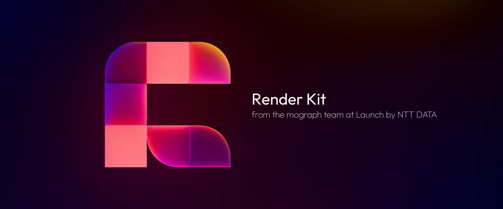
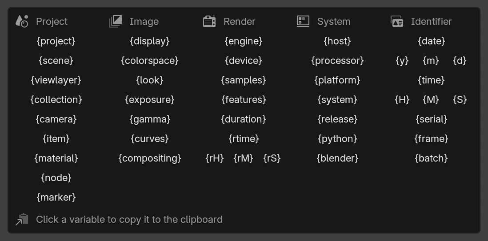
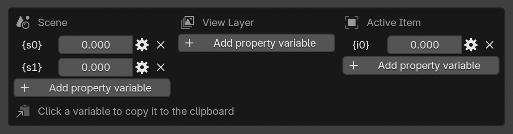
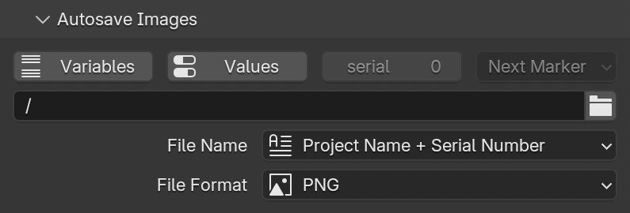
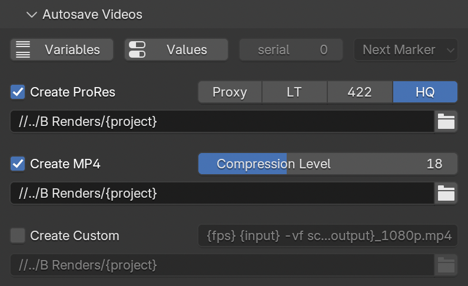
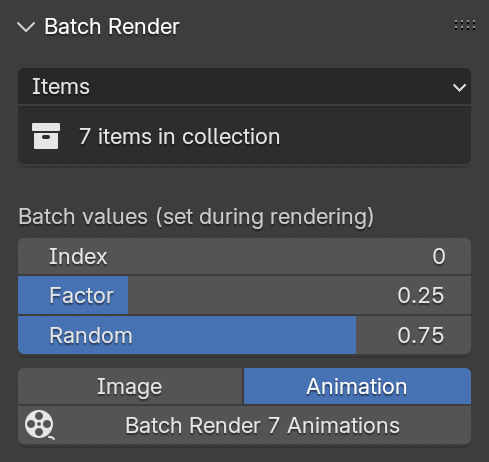
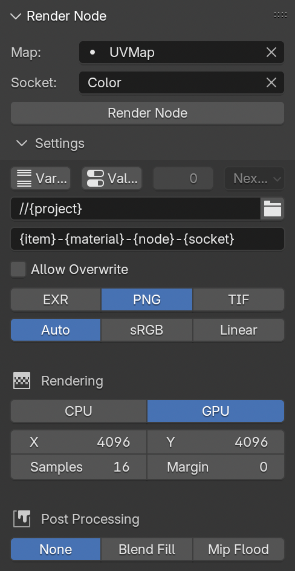
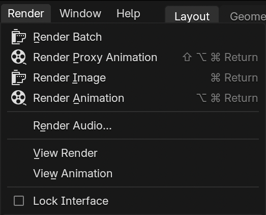
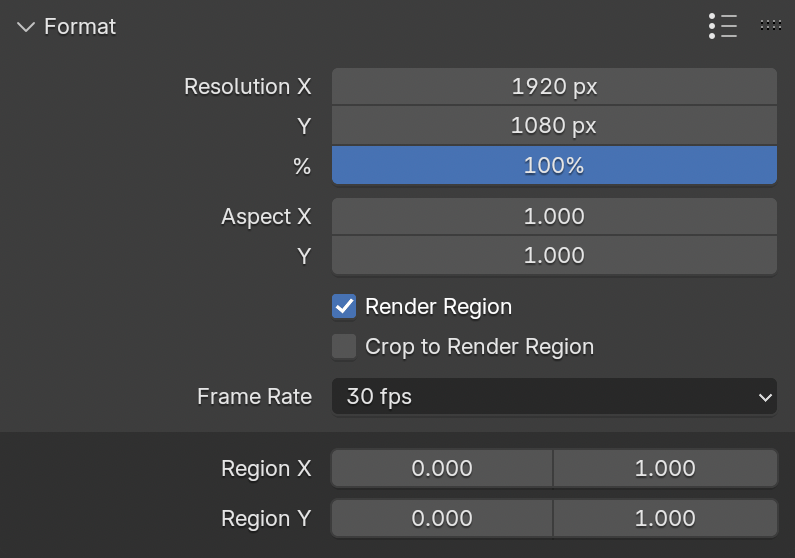

# Launch Render Kit — Blender Rendering Management

## Features:

- ### Render Variables

  - Adds dynamic variables to rendering output paths

    - Project variables:

      - `{{project}}` = current project name (project must be saved for this to work)

      - `{{scene}}` = active scene as defined in the UI (not rendered output)

      - `{{viewlayer}}` = active view layer as defined in the UI (not rendered output)

      - `{{collection}}` = active collection name (as selected in the outliner, also works with Batch Render feature)

      - `{{camera}}` = active camera name (works with Batch Render feature)

      - `{{item}}` = active item name (as selected in the outliner or 3D view, also works with Batch Render feature)
    
      - `{{material}}` = active material name of the active item (most useful in the context of the Render Node feature)
    
      - `{{node}}` = active node of the active material of the active item (most useful in the context of the Render Node feature)
    
      - `{{socket}}` = selected socket of the active node being rendered (only available when using Render Node from within the Material Editor)
    
      - `{{marker}}` = name of the nearest marker at or before the current frame
        - `{{marker:NEXT}}` = name of the nearest marker at or *after* the current frame
    
        - `{{marker:CAM}}` = name of the nearest marker at or before the current frame *with a camera attached*
    
        - `{{marker:string}}` = name of the nearest marker at or before the current frame *that contains the string*
    
        - Stacking all three options is allowed: `{{marker:NEXT:CAM:string}}`
    
        - To use the reserved `NEXT` or `CAM` variables as a test string, prepend an equal sign: `{{marker:=CAM}}` (will return markers with names that contain the string "CAM" regardless of camera attachment)
    
    - Image variables:
    
      - `{{display}}` = display device set in colour management
    
      - `{{space}}` = view transform applied in colour management
    
      - `{{look}}` = look applied in colour management
    
      - `{{exposure}}` = scene exposure value
    
      - `{{gamma}}` = scene gamma value
    
      - `{{curves}}` = indicates if scene curves are enabled (otherwise "off")
    
      - `{{balance}}` = returns kelvin and tint values if scene white balance is enabled (otherwise "off")
    
      - `{{compositing}}` = indicates if compositing is enabled (otherwise "off")
    
    - Render variables:
    
      - `{{engine}}` = render engine (Workbench, Eeevee, Cycles, Hydra Storm, Radeon ProRender, LuxCore)
    
      - `{{device}}` = render device (CPU, GPU)
    
      - `{{samples}}` = number of samples (includes different sets of data depending on engine)
    
      - `{{features}}` = render engine features enabled/disabled (includes different sets of data depending on engine)
    
      - `{{duration}}` = total render time in seconds (only available for final outputs)
    
      - `{{rtime}}` = total render time in HH-MM-SS format (only available for final outputs)
    
      - `{{rH}}` `{{rM}}` `{{rS}}` = total render time hour, minute, or second (for custom total render time formatting)
    
    - System variables:
    
      - `{{host}}` = computer name
    
      - `{{processor}}` = hardware info
    
      - `{{platform}}` = operating system (MacOS, Linux, Windows)
    
      - `{{system}}` = system info
    
      - `{{release}}` = Blender release info
    
      - `{{python}}` = current Python version in Blender
    
      - `{{blender}}` = current Blender version
    
    - Identifier variables:
    
      - `{{date}}` = current date in YYYY-MM-DD format
    
      - `{{y}}` `{{m}}` `{{d}}` = the current year, month, or day (for custom date formats)
    
      - `{{time}}` = current time in HH-MM-SS format
    
      - `{{H}}` `{{M}}` `{{S}}` = the current hour, minute, or second (for custom time formats)
    
      - `{{serial}}` = current render serial number (increments each time a render is started)
    
      - `{{frame}}` = current frame being rendered (same as `####`)
    
      - `{{batch}}` = batch rendering index (returns 0 if not batch rendering)
    
    - The name of the current project, scene, view layer, collection, camera, selected item, material, node, socket (for node rendering only), or closest timeline marker
    
    - The selected render engine, device, samples, features, and rendering duration (in total seconds or HH:MM:SS formats)
    
    - The current computer host, processor, platform, system type, OS version, Python version, and Blender version
    
    - Date, time, global serial number, current frame, and batch rendering index (see below batch feature)
    
      
    
    - Custom scene, render layer, and item data options are listed in a popup and a 3D view panel, with values that can be set using drivers or animation data
    
      

- ### Autosave Images

  - Automatically saves every render in a specified folder using custom name and formatting

    

- ### Autosave Videos

  - Automatically processes image sequences using FFmpeg after rendering completes

    

- ### Render Batch

  - One-click rendering of collections, items, cameras, or texture folders to individual images or sequences

    

- ### Render Node

  - One-click baking of material nodes to texture files

    

- ### Render Proxy

  - Shortcut for triggering a proxy render with resolution and engine settings

    

- ### Render Region

  - Adds numerical inputs for the render region feature

    

- ### Render Data

  - Tracks the total time spent rendering a project and displays estimated time remaining during animation sequence rendering

- ### Render Notifications

  - Sends a push notification or announces render statistics at the completion of renders over a given time limit

## Installation via Extensions Platform:

- Go to Blender Preferences > Get Extensions > Repositories > **＋** > Add Remote Repository
- Set the URL to `https://jeinselen.github.io/Launch-Blender-Extensions/index.json`
- Enable `Check for Updates on Start`
- Filter the available extensions for "Launch" and install as needed

## Installation via Drag-and-Drop:

- Click and drag one of the file links from the [repository list page](https://jeinselen.github.io/Launch-Blender-Extensions/) into Blender

## Installation via Download:

- Download the .zip file
- Drag-and-drop the file into Blender

These latter two methods will not connect to the centralised repository here on GitHub and updates will not be automatically available. If you don't need easy updates, don't want GitHub servers to be pinged when you start up Blender, or would just like to try some extensions without adding yet another repository to your Blender settings, this is the option for you.

## Notes:

Software is provided as-is with no warranty or provision of suitability. These are internal tools and are shared because we want to support an open community. Bug reports are welcomed, but we cannot commit to fixing or adding features. Not all features may be actively maintained, as they're updated on an as-needed basis.
